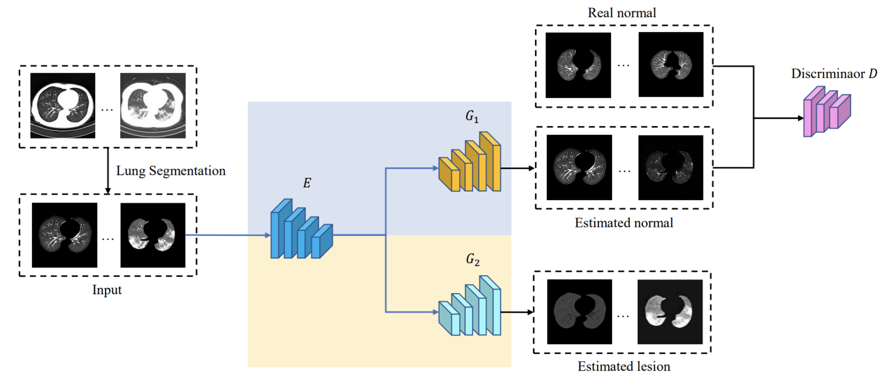

# Towards Unbiased COVID-19 Lesion Localisation and Segmentation via Weakly Supervised Learning (ISBI-2021)

by Yang Yang,  Jiancong Chen, Ruixuan Wang, Ting Ma, Lingwei Wang, Jie Chen, Wei-Shi Zheng, Tong Zhang.

This repo contains the official Pytorch implementation for [Towards Unbiased COVID-19 Lesion Localisation and Segmentation via Weakly Supervised Learning](https://ieeexplore.ieee.org/abstract/document/9433806/).


## Framwork 




```
@inproceedings{yang2021towards,
  title={Towards Unbiased COVID-19 Lesion Localisation and Segmentation via Weakly Supervised Learning},
  author={Yang, Yang and Chen, Jiancong and Wang, Ruixuan and Ma, Ting and Wang, Lingwei and Chen, Jie and Zheng, Wei-Shi and Zhang, Tong},
  booktitle={IEEE International Symposium on Biomedical Imaging},
  pages={1966--1970},
  year={2021},
  organization={IEEE}
}
```


## Installation

* Python 3.8+

* Pytorch 1.10+

* Torchvision 0.11.0

* GPU, such as a 1080Ti 

  You can install require modules with following command.

```bash
pip install -r requirements.txt
```


## Data

Data is stored in ./data, you can directory download.


## Training and Evaluation

```bash
python train.py -p /path/to/save_model_directory -l 10 -s 0.01 -a 0.01 -g 200 -t 0 -i 15 -b 4 -e 120 --debug
```


## Contact

If you have any questions about this paper, welcome to email to [zhangt02@pcl.ac.cn](mailto:zhangt02@pcl.ac.cn)

